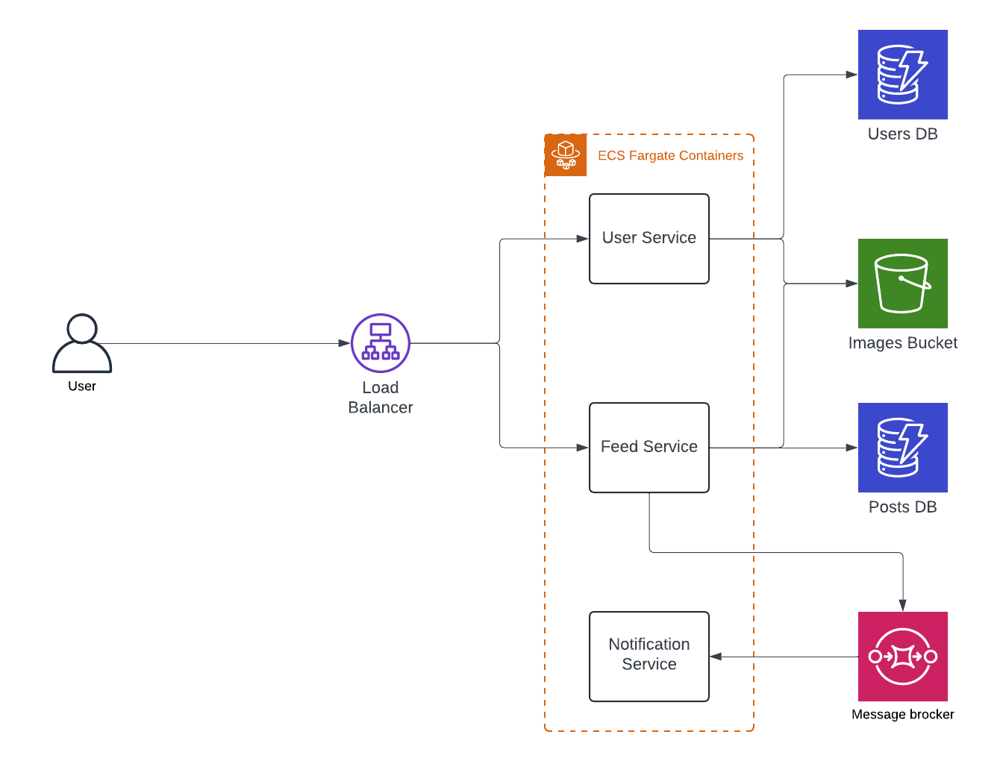

# Introduction

The Full-Stack Feed Application is an interactive platform where users can create, view, and engage with a personalized feed of content. Users can publish posts, like and comment on others' content, and follow other users to see their updates in real-time. Built to be scalable and responsive, this application is designed to deliver a smooth and immersive experience across various devices, making content sharing and social interactions accessible and seamless.

# Architecture Overview

